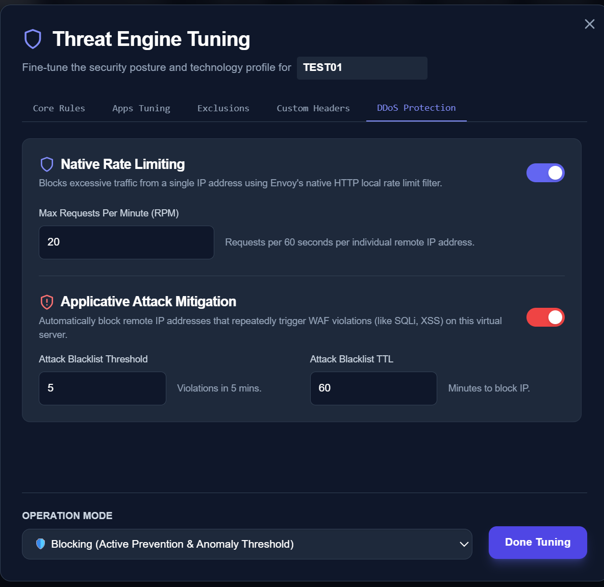
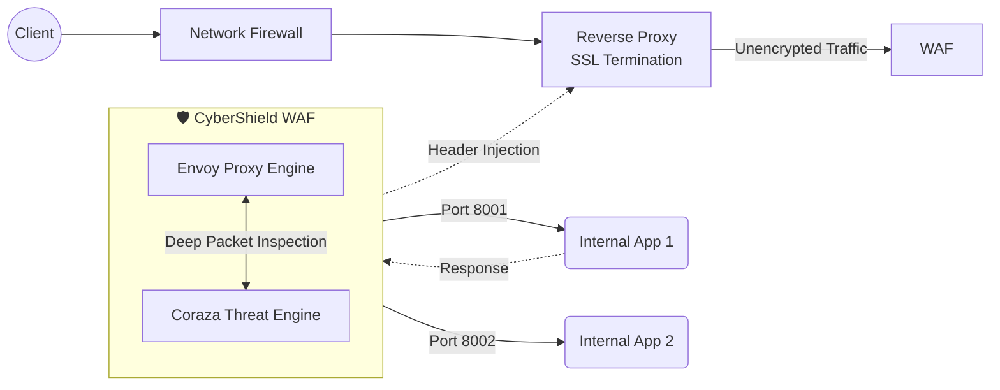

# 🛡️ CyberShield WAF

**CyberShield** is an advanced, high-performance Web Application Firewall (WAF) Control Plane built for modern cloud and on-premise infrastructure. It deeply integrates an Envoy-based data plane with a robust Python/FastAPI backend and a premium React dashboard, delivering enterprise-grade web security management with ease.


## 🌟 Key Features

* **Real-time Traffic Monitoring**: Live stream of network events, payloads, and threat blocks down to the millisecond.
* **Granular Threat Engine Tuning**: Activate advanced heuristics per Virtual Server.
  * *Protocol Enforcement & HTTP Attack Prevention*
  * *RCE, SQLi, XSS, and LFI Protections*
  * *Scanner Detection & Data Leakage Prevention*
* **Application-Specific Profiles**: Hand-tailored profiles to optimize WAF behavior for platforms like WordPress, Nextcloud, Drupal, and Node.js.
* **Role-Based Access Control (RBAC)**: Secure user separation (`admin` vs `viewer`) protecting infrastructure altering endpoints.
* **Mandatory Multi-Factor Authentication (MFA)**: Uncompromising authentication flow ensuring robust protection of the control plane itself.
* **Micro-second Envoy Proxy integration**: The backend translates UI configurations into Envoy's LDS/CDS mechanisms in real time.
* **Bidirectional Custom Headers Integration**: Dynamically inject custom HTTP Request and Response headers seamlessly via Envoy's engine.
* **Native DDoS Mitigation (Layer 7 & Active Defense)**: Block volumetric attacks by capping Requests Per Minute (RPM) per IP. Engine automatically provisions temporary DB/Proxy Blacklists (with configurable TTL) and dynamically isolates under-attack Virtual Servers via Kill-Switch.
* **Enterprise SIEM Integration**: Forward live threat traffic log payloads directly to your Security Operations Center via native UDP Syslog forwarding.
* **Audit & Alerting Engine**: Track every administrative modification and security override via the dedicated Audit Logging interface. Automated SMTP alerts notify operations teams during severe Layer 7 incidents.

## 📸 Screenshots

### 🌌 Spatial System Telemetry (Dashboard)
A real-time, premium glassmorphism dashboard providing an instant live overview of infrastructure health, active threat intercepts, and an animated data flow topology map.

<video src="https://github.com/haimtoledano/cybershield-waf/raw/main/assets/Dashboard.mp4" width="100%" controls autoplay loop muted></video>

### 🛡️ Authentication & MFA
Secure login panel with mandatory MFA and logo branding.


### 🖥️ Virtual Servers Management
Add and manage multiple virtual servers dynamically mapping to Envoy endpoints.


### ⚙️ Threat Engine Tuning
Take precise control over edge configurations without ever touching raw configurations.
**Core Rules:**


**Application Configurations:**


**Exclusions & WAF Behavior Modes:**


**Native DDoS Protection (Per-IP Rate Limiting):**


### 🔍 Real-Time Diagnostics
Review blocked packets, exact JSON payloads, and WAF intercepts organically.


### 👥 Strict Access Control & Auditing
Manage user access, review exhaustive administrative audit logs, and configure SMTP/Syslog systems globally.


## 🏗️ System Architecture & Traffic Flow


CyberShield is designed to sit internally, acting as the intelligent security gateway directly before your designated containerized applications. 



1. **Edge Entry:** Traffic passes through the standard organization Firewall and terminates at a generic Reverse Proxy (like NGINX or Traefik) which handles SSL/TLS certificates.
2. **Evaluation:** The proxy routes internal traffic to CyberShield (Envoy). Envoy passes the request to the Coraza WASM plugin for threat inspection based on application-specific ports.
3. **Upstream Forwarding & Injection:** If the traffic is clean, Envoy forwards the request to the target app. It dynamically injects preconfigured **Request Headers**.
4. **Return Path:** The application responds. CyberShield intercepts the payload, injects **Response Headers**, and routes it safely back to the user.

## 🛠️ Technology Stack

| Layer       | Technologies                                   |
| ----------- | ---------------------------------------------- |
| **Frontend**| React, Vite, Tailwind CSS, Lucide Icons        |
| **Backend** | Python, FastAPI, SQLAlchemy, PyJWT, PyOTP      |
| **Data**    | PostgreSQL                                     |
| **Proxy**   | Envoy, Coraza (WASM)                           |

## 🚀 Getting Started

### Prerequisites
* Docker and Docker Compose
* Node.js v18+ (for local frontend development)
* Python 3.10+ (for local backend development)

### Deployment
To spin up the entire isolated stack:
```bash
docker compose up -d --build
```
This deploys the Envoy data-plane, Postgres database, logging workers, backend API, and frontend control plane.

### Initial Setup
1. Upon first run, the system bootstraps a superadmin. Navigate to `http://localhost:5173`.
2. Initial credentials: `admin` / `CyberShield2026!`.
3. You will be immediately prompted to link your Authenticator app via QR code.

### 🌐 Port Mapping Configuration
CyberShield WAF intercepts traffic by acting as a reverse gateway between the Reverse Proxy and the target App.
* **Default Allocation:** By default, the system is configured to listen on **10 incoming ports** (`8000` to `8009`). 
* **1 App = 1 Dedicated Port:** You must assign a dedicated, unique listening port (e.g., `8001`) for each internal application you wish to protect and monitor.
* **Expanding Capability:** If your infrastructure requires protecting more than 10 upstream applications, simply expand the listener port range in the `docker-compose.yml` file under the `envoy` service `ports` array (e.g., `"8000-8020:8000-8020"`).

## 📄 Licensing

CyberShield's control plane is proprietary software. It utilizes several powerful open-source packages in its runtime environment (such as Envoy Proxy, FastAPI, and React). Please refer to the `THIRD-PARTY-NOTICES.txt` file for required attribution and OSS license compliance.
